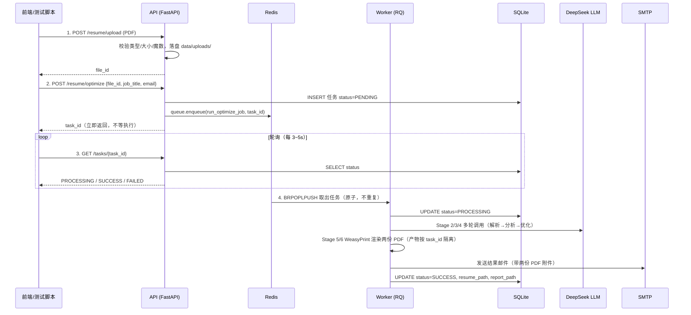

# 简历优化服务 · 三进程架构与并发分析

> 本文整理自两轮架构 QA：(1) Redis / API / Worker 三进程如何协作；(2) 当前实现如何支持并发、瓶颈在哪、可行的优化方案。
> 内容基于 `src/` 实际代码，截至 2026-06-23。

---

## 一、三进程协作机制

### 1.1 三个进程分别是什么

| 进程 | 实现 | 启动命令 | 职责 |
|------|------|----------|------|
| **Redis** | `redis-server` | `redis-server --port 6379` | 消息中间件，充当任务队列后端 |
| **API** | FastAPI + Uvicorn | `python -m src.main api` | Web 服务，接收请求、入队任务、查询状态 |
| **Worker** | RQ Worker | `python -m src.main worker` | 任务消费者，执行真正的简历优化（调 LLM、生成 PDF、发邮件） |

三者由 `start.sh` 统一管理，pid 文件落在 `.run/` 目录下（`api.pid` / `redis.pid` / `worker.pid`）。配置的单一事实来源是 `.env` 与 `src/common/config.py`，`start.sh` 通过 `load_config` 调用 Python `Config` 读取，避免 shell 与 Python 各维护一套默认值而漂移。

### 1.2 启动顺序

`start.sh` 的 `do_start all` 逻辑为：**redis → 等待端口就绪 → worker → api**。

原因：worker 和 api 都依赖 Redis 才能入队 / 出队，必须先确保 Redis 可用。`start.sh` 用 `wait_port_ready` 零依赖探测 TCP 端口（不依赖 `redis-cli`），就绪后再拉起后续进程。

```text
start all (QUEUE_BACKEND=redis)
   ├── start redis
   ├── wait_port_ready 127.0.0.1:$REDIS_PORT
   ├── start worker
   └── start api
```

### 1.3 协作数据流

```text
┌──────────┐  1.上传PDF/建任务    ┌──────────┐  2.enqueue入队   ┌─────────┐
│  前端/   │ ──────────────────▶ │   API    │ ───────────────▶ │  Redis  │
│ 测试脚本  │ ◀────────────────── │(FastAPI) │ ◀─────────────── │ (队列)   │
└──────────┘  6.轮询状态/下载     └────┬─────┘   5.查SQLite状态  └────┬────┘
                                       │ 读 SQLite                    │ 3.出队
                                       │                              ▼
                                       │                     ┌──────────────┐
                                       │                     │   Worker     │
                                       │                     │ (RQ消费)     │
                                       │                     └──────┬───────┘
                                       │                            │ 4.更新状态
                                       │            ┌───────────────┴────────┐
                                       │            ▼                        ▼
                                       │     DeepSeek LLM              SMTP 邮件
                                       │     (优化简历)                (发送结果)
                                       ▼
                                   ┌────────┐
                                   │ SQLite │  ← 任务状态表(PENDING/PROCESSING/SUCCESS/FAILED)
                                   └────────┘
                                   ┌────────┐
                                   │ 磁盘   │  ← data/uploads/(API写) + data/tasks/{task_id}/(Worker写)
                                   └────────┘
```

### 1.4 一次完整任务的时序



状态机：`PENDING → PROCESSING → SUCCESS / FAILED`。

### 1.5 三者的耦合点

- **Redis** 是 API 与 Worker 之间的**唯一运行时耦合**：API 生产任务，Worker 消费任务。
- **SQLite + 磁盘文件** 是它们共享的状态层：Worker 写进度与产物路径，API 读进度返回给前端。两者不直接互调。
- 因为异步分离：**Worker 崩溃不影响 API 接收请求**，API 重启也不丢已在 Redis 里的任务。

### 1.6 fake 简化模式（本地自测）

当 `QUEUE_BACKEND=fake` 时：

- `task_queue.get_queue()` 返回 `is_async=False` 的队列，任务在 API 进程内**同步执行**。
- `start all` 此时只启动 API（见 `start.sh` 的 `do_start`），无需 Redis / Worker。
- `run_worker.py` 检测到 fake 后端会直接退出并提示「无需独立 worker」。

用途：本地无 Redis 时的快速自测。生产形态必须用 `redis` 后端。

此外 `src/main.py` 提供 `python -m src.main all`，把 Worker 作为 API 的子进程拉起（daemon），适合单机调试真实异步形态，退出时自动回收 Worker。

---

## 二、并发能力分析

### 2.1 现状（逐层）

#### 2.1.1 API 层 —— 单进程，async 路由里有同步阻塞

`src/main.py` 的 `run_api` 调用 `uvicorn.run(...)` **未传 `workers`**，默认单进程。

更关键的是 `routes/resume.py` 中 `upload_resume` 与 `create_optimize_task` 是 `async def`，但内部调用全是**同步阻塞**的：

| 调用 | 位置 | 性质 |
|------|------|------|
| `repo.create()` / `repo.get()` | `routes/resume.py`, `routes/tasks.py` | SQLite 同步读写 |
| `queue.enqueue()` | `routes/resume.py` | RQ 同步 Redis 调用 |
| `storage.save_upload()` | `routes/resume.py` | 同步写盘 |

单次操作虽快（毫秒级），但在 `async def` 里直接调用会**阻塞事件循环**，高并发建任务 / 上传时会让其他请求排队。

**结论**：API 不是主瓶颈（重活都丢给 Worker 了），但单进程 + 同步阻塞调用，中小规模够用，上量后会卡。

#### 2.1.2 Worker 层 —— ⚠️ 最大瓶颈：单进程顺序消费

`run_worker.py` 只起了**一个** `Worker([config.QUEUE_NAME], ...)` 并调用 `worker.work()`。RQ Worker 默认**单进程、单线程、一次只跑一个任务**。

而单个任务 `run_optimize_job` 要跑 Agent 全流程（多轮 DeepSeek 调用 + PDF 渲染），耗时几十秒到几分钟。这意味着：**10 个用户同时提交，第 10 个要等前面 9 个跑完**，体验灾难。

这是当前并发能力的**真正天花板**。

#### 2.1.3 SQLite 层 —— 配置正确，当前不是瓶颈

`task_repo.py` 的 `_conn()` 用了 `PRAGMA journal_mode=WAL` + `PRAGMA busy_timeout=30000`，每次操作新建连接。WAL 是「多读单写」，写串行但带 30s 重试。任务状态写入频率极低（每个任务就几次 update），多 Worker 下也扛得住。

#### 2.1.4 存储层 —— 已做好并发隔离 ✅

`storage.task_output_dir(task_id)` 按 `task_id` 隔离产物目录；`file_id` / `task_id` 用 `uuid4` 生成。**并发任务不会互相覆盖**，这层做对了。

#### 2.1.5 Agent 层 —— 实例隔离安全，但有库的线程安全坑

`jobs.py` 每个 job 新建 `Config()` 实例并设独立 `OUTPUT_DIR`，传给新建的 `ResumeOptimizerAgent`。实例间无共享状态，**单进程内串行安全**。

但要注意：`WeasyPrint` 和 `pdfplumber` **不是完全线程安全**的。将来若要在单 Worker 进程内用线程池并发跑多个 job，有风险。**进程级隔离比线程级更稳妥**。

#### 2.1.6 外部约束 —— DeepSeek API 限流

横向扩 Worker 后，并发 LLM 调用会打到 DeepSeek，受其 QPS / 并发限制。这是扩容后会暴露的**新瓶颈**，需要客户端限流 / 重试。

### 2.2 瓶颈优先级

| 优先级 | 瓶颈 | 影响 |
|--------|------|------|
| 🔴 P0 | Worker 单进程顺序消费 | 并发任务只能串行，直接决定能同时服务几个用户 |
| 🟡 P1 | API 单进程 + async 里同步阻塞 | 上量后请求响应性下降，中小规模影响有限 |
| 🟢 P2 | SQLite 单写 | 当前写入量极小，多 Worker 下仍 OK |
| 🟡 P1' | DeepSeek 限流（扩容后暴露） | Worker 越多越容易触发，需配限流 / 重试 |

---

## 三、并发优化可行性建议（供决策）

### 方案 A：横向扩展 Worker 进程 ⭐推荐首选

**做法**：不改代码，启动多个 Worker 进程消费同一队列。
- `./start.sh start worker` 多次，或用 systemd / supervisord 管理 N 个进程。
- Redis + RQ 天然支持，任务原子分发、不重复执行（BRPOPLPUSH/BLMOVE）。
- 每个任务独立进程，规避 WeasyPrint / pdfplumber 线程安全问题。

**成本**：极低（零代码改动，仅运维配置）。
**收益**：N 个 Worker → 理论上 N 倍任务吞吐。
**风险 / 约束**：
- 每个进程加载 langchain 等，内存占用 ×N。2vCPU/4GB 建议开 2~3 个。
- 会撞 DeepSeek 限流（需配合方案 E）。
- 可在 config 加 `WORKER_COUNT` 约定，但实际并发由进程数决定。

### 方案 B：API 多进程（uvicorn workers）

**做法**：`uvicorn.run(..., workers=N)` 或用 gunicorn `-k uvicorn.workers.UvicornWorker -w N` 管理。注意 `workers` 与 `reload` 互斥。

**成本**：低（改一行配置 + 部署脚本）。
**收益**：API 层利用多核，扛更多上传 / 查询并发。
**风险**：多进程共享 SQLite 靠 WAL 兜底，OK。
**建议**：**优先级低于 A**，当前 API 不是瓶颈，等流量上来再做。

### 方案 C：async 路由里的同步调用包 `asyncio.to_thread`

**做法**：把 `repo.create`、`queue.enqueue`、`storage.save_upload` 等用 `await asyncio.to_thread(...)` 包装，避免阻塞事件循环。

**成本**：低（局部改动 2~3 个路由函数）。
**收益**：高并发建任务 / 上传时 API 响应更平滑。
**建议**：和 B 互补，但中小规模收益不明显，可与 B 一起做。

### 方案 D：换 Celery（长期）

**做法**：RQ → Celery，用 prefork 并发池、自动重试、优先级队列、任务路由。

**成本**：中（迁移 + 配置 broker）。
**收益**：功能更全，并发模型更灵活。
**建议**：**短期没必要**，`fullstack_plan.md` 已预留为升级路径，等 A 方案扛不住再考虑。

### 方案 E：LLM 客户端限流 + 重试（扩容必备配套）

**做法**：在 Agent 的 LLM 调用层加信号量 / 令牌桶限制全局并发数，并对 429 / 超时做指数退避重试。

**成本**：中（改 `core/agent.py` 的 LLM 调用封装）。
**收益**：扩 Worker 后不被 DeepSeek 限流打挂。
**建议**：**只要做 A，就应配套做 E**，否则多 Worker 会互相触发限流导致大面积失败。

### 推荐组合

> **A + E**（多 Worker 进程 + LLM 限流重试）是性价比最高的第一步，几乎零代码改动就能把并发能力从「1」拉到「N」，同时控制住外部限流风险。

B / C 留作流量上来后的 API 层优化；D 作为长期升级路径暂不动。

---

## 四、附录：关键代码位置

| 关注点 | 文件 | 说明 |
|--------|------|------|
| 服务统一入口 | `src/main.py` | `run_api` / `run_worker` / `run_all` |
| 进程管理脚本 | `start.sh` | `do_start` 控制启动顺序与 fake 简化 |
| 队列层 | `src/api/worker/task_queue.py` | `get_redis` / `get_queue`，redis 与 fake 双后端 |
| 任务封装 | `src/api/worker/jobs.py` | `run_optimize_job`，产物按 task_id 隔离 |
| Worker 入口 | `src/api/worker/run_worker.py` | 单 Worker 监听队列 |
| 入队接口 | `src/api/routes/resume.py` | `create_optimize_task` 同步入队后立即返回 |
| 状态查询 | `src/api/routes/tasks.py` | 轮询读 SQLite |
| 任务仓储 | `src/api/services/task_repo.py` | WAL + busy_timeout，每次操作新连接 |
| 存储隔离 | `src/api/services/storage.py` | `task_output_dir` 按 task_id 隔离 |
| Agent 核心 | `src/core/agent.py` | 6 Stage 串行，实例无共享状态 |
| 配置 | `src/common/config.py` | `QUEUE_BACKEND` / `QUEUE_ASYNC` / `AGENT_MODE` 等 |
