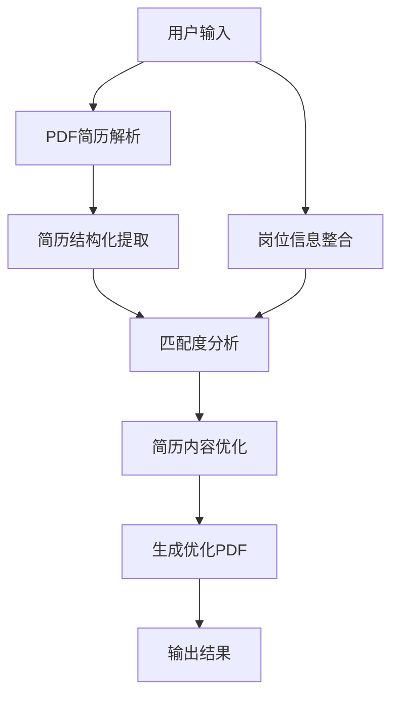

# 简历优化 Agent 设计方案

## 1. 系统概览

基于 LangChain + DeepSeek + Python 构建的简历优化 Agent，能够解析用户简历，结合目标岗位信息，输出针对性优化后的简历 PDF。

```
┌─────────────────────────────────────────────────────┐
│                  Resume Optimizer Agent              │
├─────────────────────────────────────────────────────┤
│                                                     │
│  输入层                                              │
│  ├── PDF简历解析 (pdfplumber)                       │
│  ├── 目标岗位名称 (文本)                             │
│  └── 岗位描述/要求 (文本，选填)                      │
│                                                     │
│  处理层 (LangChain Agent)                           │
│  ├── 简历内容结构化提取                              │
│  ├── 岗位匹配度分析                                  │
│  ├── 简历内容优化 (DeepSeek LLM)                    │
│  └── 优化建议生成                                    │
│                                                     │
│  输出层                                              │
│  └── 生成优化后的简历 PDF (ReportLab/WeasyPrint)    │
│                                                     │
└─────────────────────────────────────────────────────┘
```

## 2. 技术选型

| 组件 | 技术方案 | 说明 |
|------|----------|------|
| LLM | DeepSeek (deepseek-chat) | 通过 OpenAI 兼容接口调用 |
| 框架 | LangChain | Agent 编排、Chain 组合、Prompt 管理 |
| PDF解析 | pdfplumber | 支持表格、文本提取，效果优于 PyPDF2 |
| 图片OCR | 暂不实现，后续扩展 | - |
| PDF生成 | WeasyPrint | 支持 HTML/CSS 转 PDF，排版灵活 |
| 语言 | Python 3.10+ | |

## 3. 项目结构

```
cv/
├── doc/
│   └── design.md            # 本设计文档
├── pdf/                     # 存放输入的简历PDF
├── output/                  # 存放输出的优化简历PDF
├── src/
│   ├── __init__.py
│   ├── main.py              # 入口，CLI交互
│   ├── agent.py             # LangChain Agent 定义
│   ├── chains/
│   │   ├── __init__.py
│   │   ├── parse_chain.py   # 简历解析 Chain
│   │   ├── analyze_chain.py # 匹配度分析 Chain
│   │   └── optimize_chain.py# 简历优化 Chain
│   ├── tools/
│   │   ├── __init__.py
│   │   ├── pdf_parser.py    # PDF解析工具
│   │   └── pdf_generator.py # PDF生成工具
│   ├── prompts/
│   │   ├── parse.py         # 简历结构化提取 Prompt
│   │   ├── analyze.py       # 匹配度分析 Prompt
│   │   └── optimize.py      # 优化建议 Prompt
│   └── config.py            # 配置（API Key、模型参数等）
├── templates/
│   └── resume.html          # 简历PDF模板（HTML+CSS）
├── requirements.txt
└── README.md
```

## 4. 核心流程设计

### 4.1 Agent 工作流（Sequential Chain）



### 4.2 各阶段详细设计

#### Stage 1: 输入解析

```python
# pdf_parser.py
import pdfplumber

def extract_text_from_pdf(pdf_path: str) -> str:
    """从PDF提取全部文本内容"""
    text = ""
    with pdfplumber.open(pdf_path) as pdf:
        for page in pdf.pages:
            text += page.extract_text() or ""
    return text
```

#### Stage 2: 简历结构化提取

通过 LLM 将原始文本结构化为 JSON。

**关键设计：动态 schema + JSON 修复机制**

对于简历字段多样性问题，不预设固定 schema，而是让 LLM 自适应提取，仅约束顶层必选字段：

```python
# prompts/parse.py
PARSE_PROMPT = """你是一个专业的简历解析专家。请将以下简历文本解析为结构化JSON格式。

简历原文：
{resume_text}

## 输出要求：
1. 严格输出合法JSON，不要添加任何markdown标记或额外文字
2. 根据简历实际内容提取，没有的字段填空数组[]或空字符串""，不要捏造
3. 如果简历中有额外板块（如"自我评价"、"获奖经历"、"语言能力"等），请在extra_sections中保留

JSON结构：
{{
    "basic_info": {{
        "name": "",
        "phone": "",
        "email": "",
        "location": "",
        "linkedin": "",
        "personal_site": ""
    }},
    "summary": "",
    "education": [
        {{"school": "", "degree": "", "major": "", "period": "", "gpa": ""}}
    ],
    "work_experience": [
        {{"company": "", "position": "", "period": "", "description": ""}}
    ],
    "projects": [
        {{"name": "", "role": "", "period": "", "description": "", "tech_stack": []}}
    ],
    "skills": [],
    "certifications": [],
    "extra_sections": {{}}
}}

extra_sections示例：如果简历有"自我评价"段落，输出 "extra_sections": {{"self_evaluation": "内容..."}}
如果有"获奖经历"，输出 "extra_sections": {{"awards": [...]}}
"""
```

**JSON 输出可靠性保障（解决问题1）：**

```python
# tools/json_fixer.py
import json
import re
from langchain_core.output_parsers import JsonOutputParser
from pydantic import BaseModel, Field
from typing import Optional

def robust_parse_json(llm_output: str, llm=None, max_retries: int = 2) -> dict:
    """多层容错的JSON解析策略"""
    
    # Layer 1: 提取 JSON 块（去掉 ```json 等标记）
    json_str = extract_json_block(llm_output)
    
    # Layer 2: 直接解析
    try:
        return json.loads(json_str)
    except json.JSONDecodeError:
        pass
    
    # Layer 3: 常见问题自动修复
    fixed = auto_fix_json(json_str)
    try:
        return json.loads(fixed)
    except json.JSONDecodeError:
        pass
    
    # Layer 4: 用 LLM 修复（retry）
    if llm and max_retries > 0:
        repair_prompt = f"以下JSON格式有误，请修复并只输出合法JSON：\n{json_str}"
        repaired = llm.invoke(repair_prompt).content
        return robust_parse_json(repaired, llm=None, max_retries=0)
    
    raise ValueError("JSON解析失败，无法修复")


def extract_json_block(text: str) -> str:
    """从LLM输出中提取JSON内容"""
    # 去掉 ```json ... ``` 包裹
    pattern = r'```(?:json)?\s*\n?(.*?)\n?```'
    match = re.search(pattern, text, re.DOTALL)
    if match:
        return match.group(1).strip()
    # 尝试找第一个 { 到最后一个 }
    start = text.find('{')
    end = text.rfind('}')
    if start != -1 and end != -1:
        return text[start:end+1]
    return text


def auto_fix_json(json_str: str) -> str:
    """自动修复常见JSON问题"""
    # 修复末尾多余逗号
    json_str = re.sub(r',\s*([}\]])', r'\1', json_str)
    # 补全缺失的右括号
    open_braces = json_str.count('{') - json_str.count('}')
    open_brackets = json_str.count('[') - json_str.count(']')
    json_str += '}' * max(0, open_braces)
    json_str += ']' * max(0, open_brackets)
    return json_str
```

**另一种方案：使用 LangChain 的 `with_structured_output`（推荐）：**

```python
# 利用 DeepSeek 的 JSON Mode，从协议层保证输出合法JSON
from langchain_openai import ChatOpenAI

llm_json = ChatOpenAI(
    model="deepseek-chat",
    openai_api_key=config.DEEPSEEK_API_KEY,
    openai_api_base="https://api.deepseek.com",
    model_kwargs={"response_format": {"type": "json_object"}},  # 强制JSON输出
)
```

> **两种方案对比**：  
> - `response_format: json_object`：API层面保证输出是合法JSON，但不保证schema符合预期  
> - `robust_parse_json` 容错层：即使模型偶尔输出不完整，也能自动修复  
> - **建议两者结合使用**：API层保底 + 代码层校验schema

---

**简历多样性处理（解决问题2）：**

Stage 1 的 pdfplumber 提取纯文本没有问题（文本型PDF都能覆盖）。核心挑战在 Stage 2 的结构化。

设计策略：

1. **不做死板的字段校验**：`extra_sections` 字段兜底所有非标板块
2. **Stage 2 输出后做字段规范化**：

```python
# tools/schema_normalizer.py

REQUIRED_FIELDS = ["basic_info", "education", "skills"]
OPTIONAL_FIELDS = ["work_experience", "projects", "certifications", "summary", "extra_sections"]

def normalize_resume_schema(parsed: dict) -> dict:
    """规范化简历结构，确保下游流程兼容"""
    result = {}
    
    # 必选字段：缺失则填默认值
    for field in REQUIRED_FIELDS:
        result[field] = parsed.get(field, {} if field == "basic_info" else [])
    
    # 可选字段：有就保留，没有不强加
    for field in OPTIONAL_FIELDS:
        if field in parsed and parsed[field]:
            result[field] = parsed[field]
    
    # extra_sections 中的内容原样保留，后续优化时会参考
    if "extra_sections" not in result:
        result["extra_sections"] = {}
    
    return result
```

3. **下游 Prompt 自适应**：分析和优化阶段的 Prompt 不硬编码字段，而是基于实际有的内容做处理

#### Stage 3: 匹配度分析

```python
# prompts/analyze.py
ANALYZE_PROMPT = """你是一位资深HR和职业顾问。请分析以下简历与目标岗位的匹配情况。

## 目标岗位：{job_title}

## 岗位描述与要求：
{job_description}

## 候选人简历（结构化）：
{structured_resume}

请从以下维度进行分析：
1. 技能匹配度（哪些技能匹配，哪些缺失）
2. 经验相关性（工作经验与岗位的关联程度）
3. 关键词覆盖（简历中是否包含JD中的关键词）
4. 优势亮点（候选人最突出的竞争力）
5. 改进空间（具体可优化的方向）

输出JSON格式的分析报告。
"""
```

#### Stage 4: 简历内容优化

```python
# prompts/optimize.py
OPTIMIZE_PROMPT = """你是一位专业的简历优化专家，擅长根据目标岗位定制简历内容。

## 目标岗位：{job_title}
## 岗位描述：{job_description}
## 原始简历（结构化）：{structured_resume}
## 匹配分析结果：{analysis_result}

请按照以下原则优化简历内容：
1. 保持信息真实性，不捏造经历，只优化表述方式
2. 用STAR法则重写工作经历和项目经验（情境-任务-行动-结果）
3. 量化成果（增加具体数据和百分比）
4. 突出与目标岗位匹配的技能和经验
5. 优化关键词覆盖率，自然融入JD中的关键术语
6. 精简无关内容，聚焦核心竞争力
7. 优化个人总结/摘要，使其与目标岗位高度契合

请输出完整的优化后简历内容（保持JSON结构化格式）。
"""
```

#### Stage 5: PDF生成

```python
# tools/pdf_generator.py
from weasyprint import HTML
from jinja2 import Template

def generate_resume_pdf(optimized_data: dict, template_path: str, output_path: str):
    """使用HTML模板+WeasyPrint生成PDF"""
    with open(template_path, "r") as f:
        template = Template(f.read())
    
    html_content = template.render(**optimized_data)
    HTML(string=html_content).write_pdf(output_path)
    return output_path
```

### 4.3 Agent 编排（LangChain）

```python
# agent.py
from langchain_openai import ChatOpenAI
from langchain.chains import SequentialChain
from langchain_core.runnables import RunnablePassthrough, RunnableLambda

class ResumeOptimizerAgent:
    def __init__(self, config):
        self.llm = ChatOpenAI(
            model="deepseek-chat",
            openai_api_key=config.DEEPSEEK_API_KEY,
            openai_api_base="https://api.deepseek.com",
            temperature=0.3,
        )
    
    def run(self, pdf_path: str, job_title: str, job_description: str = "") -> str:
        # Step 1: 解析PDF
        resume_text = extract_text_from_pdf(pdf_path)
        
        # Step 2: 结构化提取
        structured_resume = self._parse_resume(resume_text)
        
        # Step 3: 匹配分析
        analysis = self._analyze_match(structured_resume, job_title, job_description)
        
        # Step 4: 优化简历
        optimized = self._optimize_resume(
            structured_resume, job_title, job_description, analysis
        )
        
        # Step 5: 生成PDF
        output_path = generate_resume_pdf(optimized, "templates/resume.html", "output/optimized_resume.pdf")
        
        return output_path
```

## 5. 配置管理

```python
# config.py
import os
from dataclasses import dataclass

@dataclass
class Config:
    DEEPSEEK_API_KEY: str = os.getenv("DEEPSEEK_API_KEY", "")
    DEEPSEEK_BASE_URL: str = "https://api.deepseek.com"
    MODEL_NAME: str = "deepseek-chat"
    TEMPERATURE: float = 0.3
    MAX_TOKENS: int = 4096
    OUTPUT_DIR: str = "output"
    TEMPLATE_DIR: str = "templates"
```

## 6. CLI 入口设计

```python
# main.py
import argparse

def main():
    parser = argparse.ArgumentParser(description="简历优化Agent")
    parser.add_argument("--resume", "-r", required=True, help="简历PDF路径")
    parser.add_argument("--job-title", "-j", required=True, help="目标岗位名称")
    parser.add_argument("--job-desc", "-d", default="", help="岗位描述/要求文本（选填）")
    parser.add_argument("--output", "-o", default="output/optimized_resume.pdf", help="输出路径")
    
    args = parser.parse_args()
    
    agent = ResumeOptimizerAgent(Config())
    result = agent.run(
        pdf_path=args.resume,
        job_title=args.job_title,
        job_description=args.job_desc
    )
    print(f"优化完成，输出文件：{result}")

if __name__ == "__main__":
    main()
```

## 7. 依赖清单

```
# requirements.txt
langchain>=0.2.0
langchain-openai>=0.1.0
langchain-core>=0.2.0
pdfplumber>=0.10.0
weasyprint>=60.0
jinja2>=3.1.0
python-dotenv>=1.0.0
```

## 8. 关键设计决策

### Q1: 为什么用 SequentialChain 而不是 ReAct Agent？

简历优化流程是**确定性的线性流程**（解析→分析→优化→生成），不需要 Agent 自主决策调用哪个工具。SequentialChain 更可控、更高效。

### Q2: 为什么选 WeasyPrint 生成 PDF？

- 支持 HTML+CSS 排版，设计灵活度高
- 支持中文字体
- 相比 ReportLab 的代码式布局，模板维护成本更低
- 可通过修改 CSS 快速更换简历样式

### Q3: 如何保证输出质量？

- **JSON可靠性**：`response_format: json_object` API层保底 + `robust_parse_json` 代码层容错修复 + LLM retry兜底
- **简历多样性**：动态schema + `extra_sections`兜底 + `normalize_resume_schema`规范化
- Prompt 中明确要求"不捏造信息"
- 结构化 JSON 中间格式便于校验
- 可增加人工确认环节（review模式）

### Q4: 图片识别方案？

暂不实现，后续作为扩展功能加入。当前版本岗位描述通过文本直接输入。

## 9. 后续可扩展方向

- [ ] 支持多种简历模板切换
- [ ] 增加 Web UI（Streamlit/Gradio）
- [ ] 岗位描述图片 OCR 识别（DeepSeek Vision）
- [ ] 支持批量处理
- [ ] 增加简历评分功能
- [ ] 支持更多输入格式（Word、图片简历）
- [ ] 增加 ATS（Applicant Tracking System）兼容性检查

## 10. 风险与注意事项

1. **隐私安全**：简历包含个人敏感信息，API 调用需注意数据安全
2. **LLM 幻觉**：必须在 Prompt 中强调不能捏造经历，输出需人工复核
3. **PDF 排版**：中文字体、表格对齐需额外调试
4. **Token 限制**：长简历可能超出单次调用上限，需考虑分段处理
