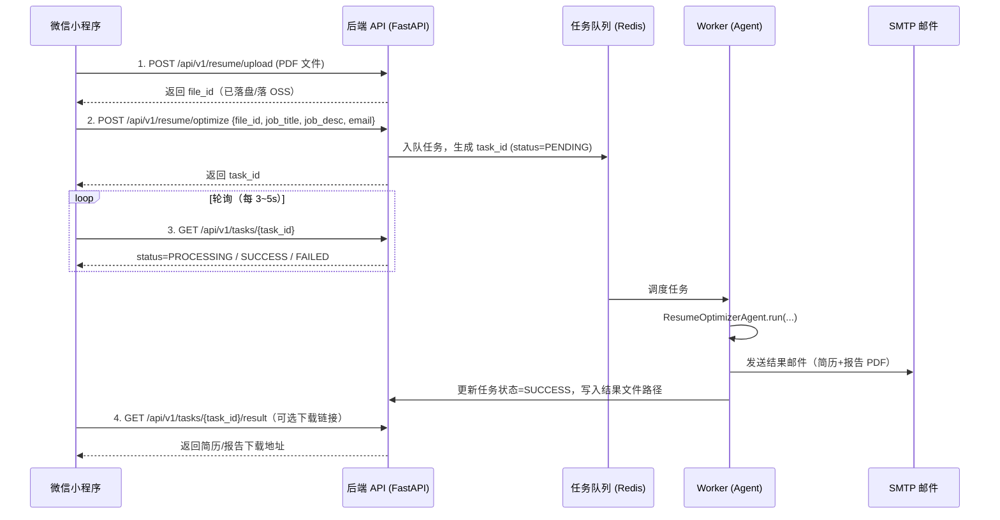

# 简历优化产品 · 前后端分离方案（v1 评审稿）

> 目标：把现有的命令行版「简历优化 Agent」升级为一个**前后端分离**的线上产品。
> 前端：微信小程序（上传 PDF 简历、填写邮箱与目标岗位）。
> 后端：服务端封装现有 Agent，异步处理并把结果通过邮件发送给用户。
> 阶段定位：**先跑通业务闭环**，并发先不追求，但架构上预留扩展点。

---

## 0. 评审确认（v1 已定，2026-06-18）

| 决策点 | v1 结论 |
|--------|---------|
| 结果交付方式 | **只发邮件**（任务状态接口保留，便于前端轮询/测试；下载接口先用于本地验证） |
| 存储 | **本地磁盘**，不接 OSS/OBS（保留 storage 抽象接口，便于后续切换） |
| 任务队列 | **直接 Redis + RQ** |
| 前端 | 微信小程序**要做**，但本阶段先实现后端 |
| 云存储 | 暂不考虑 |
| 域名/资质 | 暂无，**先把服务端实现并自测**，上云与备案后置 |

> 当前阶段目标：**先实现后端**，用 `test/` 下的脚本**模拟前端**完成「上传 → 创建任务 → 轮询状态 → 收到邮件 / 下载产物」的交互测试、调试与验证。

---

## 1. 现状盘点（基于现有代码）

| 能力 | 现有实现 | 说明 |
|------|----------|------|
| 核心流程 | `ResumeOptimizerAgent.run(pdf_path, job_title, job_description)` | 返回 `{"resume_pdf": 路径, "report_pdf": 路径}` |
| 处理耗时 | 6 个 Stage，多轮 DeepSeek LLM 调用 | **典型耗时几十秒到数分钟**，不能放在一次 HTTP 同步请求里等 |
| 输入 | PDF 文件、岗位名称、岗位描述（选填） | 当前来自 CLI 参数 |
| 输出 | 优化后简历 PDF + 岗位匹配分析报告 PDF | 落在 `output/` 目录 |
| 邮件 | `send_resume_email(...)` 走 SMTP | 把两份 PDF 作为附件发送 |
| PDF 生成 | WeasyPrint（HTML→PDF） | **依赖系统库**（pango/cairo/gdk-pixbuf），部署需注意 |
| 配置 | `Config` 从 `.env` 读取 | API Key、SMTP 等敏感信息 |

**结论**：现有 Agent 可以**几乎零改动**地被后端复用，关键是要在它外面包一层「异步任务 + 状态查询 + 文件管理」。

---

## 2. 总体架构

```
┌──────────────────────┐         HTTPS          ┌─────────────────────────────────────────┐
│   微信小程序 (前端)   │  ───────────────────▶  │              后端服务 (云服务器)          │
│                      │                         │                                         │
│  · 选择/上传 PDF      │   1. 上传简历           │  ┌───────────────┐   ┌────────────────┐ │
│  · 填写邮箱/岗位      │ ─────────────────────▶  │  │  API 层        │   │  任务队列       │ │
│  · 提交优化任务      │                         │  │  (FastAPI)     │──▶│  (Redis + RQ/  │ │
│  · 轮询任务状态      │   2. 创建任务 task_id   │  │                │   │   Celery)      │ │
│  · 展示结果/下载     │ ◀─────────────────────  │  └───────┬───────┘   └───────┬────────┘ │
│                      │                         │          │                   │          │
│                      │   3. 轮询 status        │          ▼                   ▼          │
│                      │ ◀────────────────────▶  │  ┌───────────────┐   ┌────────────────┐ │
└──────────────────────┘                         │  │  对象存储/磁盘  │   │ ResumeOptimizer │ │
                                                 │  │  (OSS / 本地)  │   │     Agent       │ │
       邮件 (SMTP) ◀──────────────────────────── │  └───────────────┘   └───────┬────────┘ │
       用户收到优化简历 + 分析报告                 │                              │          │
                                                 │                       DeepSeek LLM API   │
                                                 └─────────────────────────────────────────┘
```

核心设计取舍：
- **异步任务**：因为 Agent 耗时长，必须「上传即返回 `task_id`，前端轮询状态」，否则小程序请求会超时（微信网络请求默认 60s 上限）。
- **结果双通道**：一方面发邮件（用户的原始诉求），另一方面前端也能查状态/下载，体验更好。
- **存储解耦**：v1 可先用服务器本地磁盘；预留切换到对象存储（OSS/OBS）的接口，方便后续扩展和多机部署。

---

## 3. 业务流程（时序）



状态机：`PENDING → PROCESSING → SUCCESS / FAILED`。

---

## 4. 后端方案

### 4.1 技术选型

| 组件 | 选型 | 理由 |
|------|------|------|
| Web 框架 | **FastAPI + Uvicorn** | 异步、自带 OpenAPI 文档、与现有 Python 代码无缝衔接 |
| 任务队列 | **Redis + RQ**（v1）/ Celery（后续） | RQ 轻量、上手快，并发小阶段够用；Celery 功能更全留作升级 |
| 进程管理 | **Gunicorn/Uvicorn + systemd** | 守护 API 与 Worker 进程 |
| 反向代理 | **Nginx** | HTTPS 终止、静态文件、限流、上传体积控制 |
| 存储 | 本地磁盘（v1）→ 阿里云 OSS / 华为云 OBS | 解耦多机部署、CDN 下载 |
| 数据库 | **SQLite（v1）→ PostgreSQL/MySQL** | 存任务记录；并发小先 SQLite，后续平滑迁移 |
| 配置 | `.env` + 环境变量 | 复用现有 `Config`，新增队列/存储配置 |

> 说明：如果想进一步简化，v1 甚至可以用 **FastAPI BackgroundTasks / 内存线程池** 替代 Redis 队列，但**重启会丢任务、无法横向扩展**。鉴于这是要上线的产品，建议直接上 Redis + RQ，成本极低（一台机器即可）。

### 4.2 目录结构（已实现）

```
src/
├── core/                   # ★ 已实现的 Agent 核心
│   ├── __init__.py         # re-export：from src.core import ResumeOptimizerAgent
│   ├── agent.py            # 简历优化 Agent（复用，仅用 config.OUTPUT_DIR 隔离产物）
│   ├── prompts/            # Agent 专用 Prompt（parse / analyze / optimize）
│   └── templates/          # PDF 渲染模板（resume.html / analysis_report.html）
├── common/                 # ★ 基础模块
│   ├── __init__.py         # re-export：from src.common import Config, logger
│   ├── config.py           # 配置：API / 存储 / 队列 / 执行模式
│   └── logger.py           # 日志（loguru）
├── tools/                  # 工具模块（无状态可复用）
│   ├── email_sender.py     # SMTP 发信
│   ├── json_fixer.py       # LLM JSON 容错解析
│   ├── pdf_parser.py       # PDF 文本提取（pdfplumber）
│   └── pdf_generator.py    # HTML→PDF（WeasyPrint）
└── api/                    # ★ Web 层
    ├── __init__.py
    ├── app.py              # FastAPI 实例、统一响应、异常处理、CORS、/health
    ├── schemas.py          # 请求模型 OptimizeRequest + 统一响应 ok()
    ├── routes/
    │   ├── resume.py       # POST /resume/upload、/resume/optimize
    │   └── tasks.py        # GET /tasks/{id}、/result、/files/{kind}
    ├── services/
    │   ├── storage.py      # 本地存储 + file_id/task_id 生成与正则校验
    │   ├── task_repo.py    # SQLite 任务表读写（WAL，多进程安全）
    │   └── mockpdf.py      # 自包含最小 PDF 生成（mock / 测试用）
    └── worker/
        ├── task_queue.py   # RQ 队列（redis / fake 两种后端）
        ├── jobs.py         # ★ 封装 agent.run + 发邮件 的任务函数
        └── run_worker.py   # RQ Worker 启动入口

test/api/test_flow.py       # 模拟前端的端到端测试脚本
test/core/test_agent.py     # 单次跑 ResumeOptimizerAgent.run 的 CLI 测试脚本
```

> 目录约定：
> - `core/` 收敛已实现的 Agent 业务（含其专用 `prompts/` 与 PDF `templates/`），对外暴露 `from src.core import ResumeOptimizerAgent`。
> - `common/` 放与业务无关的基础模块（配置、日志），对外暴露 `from src.common import Config, logger`。
> - `tools/` 放可复用的无状态工具（PDF、邮件、JSON 修复）。
> - `TEMPLATE_DIR` 默认指向 `src/core/templates` 的**绝对路径**（基于模块位置），不依赖运行时 cwd；可用环境变量 `TEMPLATE_DIR` 覆盖。
> - 原 `src/main.py` 已识别为「跑 core 的测试脚本」，迁至 `test/core/test_agent.py`；`src/` 顶层不再有入口脚本。
> - 已删除空的 `chains/` 目录。
>
> ⚠️ **命名坑（已踩并修复）**：队列模块**不能命名为 `queue.py`**。运行 `python src/api/worker/run_worker.py` 时其所在目录会进入 `sys.path`，遮蔽 Python 标准库 `queue`，导致 redis 内部 `from queue import Empty` 触发循环导入报错。已重命名为 `task_queue.py`。

### 4.3 API 设计（REST，统一前缀 `/api/v1`）

所有响应统一结构：`{ "code": 0, "message": "ok", "data": {...} }`。

**① 上传简历**
```
POST /api/v1/resume/upload
Content-Type: multipart/form-data
body: file=<pdf>

200 → data: { "file_id": "f_xxx", "filename": "resume.pdf", "size": 123456 }
```
校验：仅允许 `application/pdf`、大小 ≤ 10MB、魔数校验（防伪装）。

**② 创建优化任务**
```
POST /api/v1/resume/optimize
Content-Type: application/json
{
  "file_id": "f_xxx",
  "job_title": "Python后端开发工程师",
  "job_desc": "（选填）",
  "email": "user@example.com"
}

200 → data: { "task_id": "t_xxx", "status": "PENDING" }
```
校验：邮箱格式、`job_title` 必填、`file_id` 存在。

**③ 查询任务状态**
```
GET /api/v1/tasks/{task_id}

200 → data: {
  "task_id": "t_xxx",
  "status": "PROCESSING",          // PENDING/PROCESSING/SUCCESS/FAILED
  "progress": "Stage 4/6",         // 可选，便于前端展示进度
  "error": null,
  "created_at": "...",
  "finished_at": null
}
```

**④ 获取结果 / 下载（可选）**
```
GET /api/v1/tasks/{task_id}/result

200 → data: {
  "resume_url": "https://.../optimized_resume.pdf",
  "report_url": "https://.../analysis_report.pdf",
  "email_sent": true
}
```
下载链接用**带签名的临时 URL**（OSS STS / 自签短期 token），避免裸露文件、防越权。

### 4.4 任务封装（关键，把 Agent 包成队列任务）

`worker/jobs.py` 伪代码：

```python
def run_optimize_job(task_id, file_path, job_title, job_desc, email):
    task_repo.update(task_id, status="PROCESSING")
    try:
        config = Config()
        # 关键：让产物输出到「按 task_id 隔离」的目录，避免并发互相覆盖
        config.OUTPUT_DIR = storage.task_output_dir(task_id)

        agent = ResumeOptimizerAgent(config)
        result = agent.run(file_path, job_title, job_desc)

        resume_pdf = result["resume_pdf"]
        report_pdf = result.get("report_pdf")

        if email:
            attachments = [p for p in (resume_pdf, report_pdf) if p]
            send_resume_email(email, f"{job_title} - 优化后的简历",
                              "您好，附件是优化后的简历，请查收。",
                              attachments, config)

        # 上传到 OSS 并生成下载链接（v1 可先记录本地路径）
        urls = storage.publish(task_id, resume_pdf, report_pdf)
        task_repo.update(task_id, status="SUCCESS", result=urls, email_sent=bool(email))
    except Exception as e:
        task_repo.update(task_id, status="FAILED", error=str(e))
        raise
```

> ⚠️ 现有 `agent.run` 把产物固定写成 `output/optimized_resume.pdf`。**必须**把 `config.OUTPUT_DIR` 设为按 `task_id` 隔离的目录（`data/tasks/{task_id}/`），否则多任务会互相覆盖文件。现有代码已支持通过 `config.OUTPUT_DIR` 控制，改动很小。
>
> 实现中还内置了两个自测开关（见附录 A）：`AGENT_MODE=mock` 用占位 PDF 不调 LLM；`QUEUE_BACKEND=fake` 在无 Redis 时同步执行。

### 4.5 数据模型（任务表）

| 字段 | 类型 | 说明 |
|------|------|------|
| task_id | TEXT (PK) | 任务唯一 ID |
| file_id | TEXT | 关联的简历文件 |
| job_title | TEXT | 目标岗位 |
| job_desc | TEXT | 岗位描述 |
| email | TEXT | 收件邮箱（可空） |
| status | TEXT | PENDING/PROCESSING/SUCCESS/FAILED |
| progress | TEXT | 进度文案（可空） |
| resume_path / report_path | TEXT | 产物路径或 URL |
| email_sent | INTEGER | 是否已发邮件 |
| error | TEXT | 失败原因 |
| created_at / finished_at | DATETIME | 时间戳 |

### 4.6 安全与稳健性
- **鉴权**：v1 可用「微信登录态」换取后端会话 token（`wx.login` → `code` → 后端换 `openid` → 签发 JWT）。即便先不做完整账号体系，也建议加一个轻量 token，防止接口被刷。
- **限流**：Nginx + 应用层对「创建任务」按 IP/openid 限流（如每分钟 N 次），防止刷 LLM 额度（**LLM 调用是真金白银**）。
- **文件校验**：类型、大小、PDF 魔数；上传目录与 Web 根隔离；文件名重命名为随机 ID。
- **密钥管理**：`DEEPSEEK_API_KEY`、`SMTP_PASSWORD` 只放服务端环境变量，**绝不下发前端**。
- **超时与重试**：LLM 调用设超时；任务失败标记 FAILED 并允许用户重试；Worker 异常隔离不影响 API。
- **清理策略**：定时清理过期产物与上传文件（如 7 天），控制磁盘/存储成本。

---

## 5. 前端方案（微信小程序）

### 5.1 页面结构
| 页面 | 功能 |
|------|------|
| 首页 / 上传页 | 选择 PDF、填写目标岗位、岗位描述（选填）、邮箱；提交 |
| 处理中页 | 展示进度（轮询 status），转圈 + 文案「正在优化第 X/6 步」 |
| 结果页 | 成功后展示「已发送到邮箱」+ 简历/报告在线预览或下载按钮 |
| 历史记录（可选） | 列出该用户的历史任务 |

### 5.2 关键交互与小程序限制
- **文件选择**：用 `wx.chooseMessageFile`（从微信聊天记录选 PDF）是目前小程序选本地文件的主流方式；小程序**无法直接访问手机文件系统任意目录**，这点要在交互上引导用户「先把简历发到某个聊天/文件传输助手，再选择」。
- **上传**：`wx.uploadFile` 走 `multipart/form-data` 调用 `/api/v1/resume/upload`。
- **轮询**：任务创建后用 `setInterval` 每 3~5s 调 `GET /tasks/{id}`，到 `SUCCESS/FAILED` 停止；注意页面卸载时清除定时器。
- **结果展示**：PDF 预览可用 `wx.downloadFile` + `wx.openDocument` 打开；同时提示「已发送到你填写的邮箱」。
- **登录**：`wx.login` 获取 `code`，换后端 token 持久化到 storage，后续请求带上。

### 5.3 必须满足的小程序合规要求 ⚠️
- **request/uploadFile 合法域名**：小程序只能请求**已在微信公众平台配置的 HTTPS 域名**（开发可临时关「校验合法域名」，上线必须配置）。
- **域名要求 HTTPS + ICP 备案**：后端域名必须备案、配 SSL 证书。
- **服务类目与隐私协议**：收集用户邮箱属于个人信息，需在小程序内提供**隐私政策**并做用户授权弹窗，否则审核不过。

### 5.4 技术栈建议
- 原生小程序（WXML/WXSS/JS）或 **uni-app**（若后续要扩展到 H5/App）。v1 体量小，原生即可，依赖少、审核简单。

---

## 6. 服务器 / 部署方案（阿里云或华为云）

### 6.1 资源清单（v1 最小可用）
| 资源 | 规格建议 | 说明 |
|------|----------|------|
| 云服务器 ECS / 华为 ECS | 2 vCPU / 4GB 起 | 跑 Nginx + FastAPI + RQ Worker + Redis；LLM 是外部调用，CPU 压力主要在 PDF 渲染 |
| 云数据库（可选） | RDS MySQL/PG 最小规格 | v1 也可先用本机 SQLite |
| 对象存储（可选） | 阿里云 OSS / 华为云 OBS | 存 PDF 产物，配 CDN 加速下载 |
| 域名 + SSL | 已备案域名 + 免费证书 | 小程序硬性要求 |
| Redis | 自建在同机即可 | 队列后端 |

> 提示：WeasyPrint 依赖系统库，**部署时需安装** `pango`、`cairo`、`gdk-pixbuf`、字体（中文字体如 Noto Sans CJK）等，否则 PDF 生成会报错。建议用 **Docker 镜像**固化这些系统依赖，避免「我机器能跑、服务器跑不了」。

### 6.2 部署形态（推荐 Docker Compose）
```
docker-compose:
  - nginx        (443 HTTPS 入口，反代到 api)
  - api          (FastAPI/Uvicorn)
  - worker       (RQ worker，复用同一镜像)
  - redis        (队列)
  - (可选) db    (postgres)
```
镜像内预装 WeasyPrint 系统依赖 + 中文字体。配置通过环境变量注入（API Key、SMTP、OSS 凭证）。

### 6.3 上线 Checklist
- [ ] 域名备案完成、HTTPS 证书就绪
- [ ] 微信公众平台配置 request/uploadFile/downloadFile 合法域名
- [ ] 小程序隐私协议 + 用户信息收集授权
- [ ] 服务端环境变量：`DEEPSEEK_API_KEY`、SMTP、（OSS）凭证
- [ ] Nginx 限制上传体积（如 `client_max_body_size 12m`）
- [ ] 接口限流，防 LLM 额度被刷
- [ ] 定时清理过期文件
- [ ] 日志与监控（沿用现有 loguru，输出到文件 + 可接入云监控）

---

## 7. 分阶段落地计划

**Phase 0 — 后端服务化（不动前端）**
1. 加 FastAPI：上传、创建任务、查询状态、下载结果 4 个接口。
2. 接 Redis + RQ，把 `agent.run` 包成任务，产物按 `task_id` 隔离。
3. 任务记录用 SQLite。本地用 Postman / curl 跑通闭环。

> ✅ **Phase 0 已实现，mock 自测 + 真实形态联调均已通过**（详见「附录 A：后端实现现状」）。

**Phase 1 — 邮件 + 产物下载打通**
4. 任务成功后发邮件（复用 `send_resume_email`）。
5. 产物先放本地，提供带 token 的下载接口。

**Phase 2 — 微信小程序 MVP**
6. 上传页 + 处理中页 + 结果页，跑通「上传→轮询→收到邮件/下载」。
7. 接 `wx.login` 轻量鉴权。

**Phase 3 — 上云 + 合规上线**
8. Docker 化、上云服务器、域名备案、HTTPS、配置小程序合法域名。
9. 限流、文件清理、隐私协议，提交小程序审核。

**Phase 4（后续）— 扩展**
- 切换 OSS/OBS + CDN；SQLite→RDS；RQ→Celery；账号体系与历史记录；并发扩容（多 Worker）。

---

## 8. 待你拍板的几个点（评审讨论）

1. **结果交付方式**：只发邮件，还是「邮件 + 小程序内下载/预览」都做？（建议都做，体验更好）
2. **存储**：v1 先用本地磁盘，还是直接上 OSS？（建议 v1 本地，预留接口）
3. **任务队列**：直接上 Redis+RQ，还是 v1 先用 FastAPI BackgroundTasks 极简版？（建议直接 RQ，避免重启丢任务）
4. **鉴权**：v1 是否要做 `wx.login` 登录态？（建议至少加轻量 token，保护 LLM 额度）
5. **云厂商**：阿里云 / 华为云二选一（接口与组件大同小异，按你账号资源定）。
6. **小程序主体**：是否已有可备案的域名与小程序主体资质？这决定上线节奏。

---

> 下一步：如果方案方向 OK，我可以先落地 **Phase 0**（在 `src/api/` 下搭出 FastAPI + RQ 骨架，并把现有 Agent 包成任务），你本地就能跑通整条链路。

---

## 附录 A：后端实现现状（截至 2026-06-22）

### A.1 当前进度

**✅ 已完成**
- [x] 扩展 `config.py`：API / 存储 / 队列 / 执行模式配置
- [x] 存储层 `storage.py`：file_id/task_id 生成与正则校验、产物按 task_id 隔离
- [x] 任务仓储 `task_repo.py`：SQLite（WAL）任务表读写，多进程安全
- [x] 队列层 `task_queue.py`：RQ + Redis，支持 `fake` 同步自测后端
- [x] 任务封装 `jobs.py`：复用 Agent，支持 `mock` 模式，按配置发邮件
- [x] 接口层：上传 / 建任务 / 查状态 / 取结果 / 下载，共 6 个端点
- [x] 统一响应结构、异常处理、CORS、健康检查
- [x] 模拟前端测试脚本 `test/api/test_flow.py`
- [x] 更新 `requirements.txt`（fastapi/uvicorn/redis/rq/python-multipart 等）
- [x] **mock 模式端到端验证通过**（fake 队列 + 占位 PDF）
- [x] **真实形态联调通过**：Redis 装入 conda `cv` 环境，API + Worker + Redis 三件套启动，真实 DeepSeek LLM 全流程跑通，产物为合法 PDF（任务 SUCCESS）

**🐛 已修复的关键问题**
- 队列模块原名 `queue.py`，运行 Worker 时脚本目录进入 `sys.path`，遮蔽 Python 标准库 `queue`，导致 redis `from queue import Empty` 循环导入报错。已重命名为 `task_queue.py` 并更新引用。

**⏳ 后端待办**
- [ ] **邮件真实发送验证**：`SEND_EMAIL=true` + 真实邮箱端到端验证收件
- [ ] **轻量鉴权**：`wx.login` 换 token / JWT，保护接口与 LLM 额度
- [ ] **接口限流**：按 IP/openid 限制建任务频率，防刷 LLM 额度
- [ ] **进度细化**：把 Agent 6 个 Stage 的进度写回 `progress` 字段
- [ ] **失败重试**：任务失败允许前端重试
- [ ] **文件清理**：定时清理过期上传与产物（如 7 天）
- [ ] **下载鉴权**：下载链接加签名/短期 token，防越权
- [ ] **Docker 化 + 上云**：固化 WeasyPrint 系统依赖 + 中文字体，部署到云服务器

### A.2 关键配置项（`src/config.py`，均可用 `.env` / 环境变量覆盖）
| 变量 | 默认 | 说明 |
|------|------|------|
| `QUEUE_BACKEND` | `redis` | `redis`=生产（需 Redis + worker）；`fake`=本地同步自测，无需 Redis |
| `QUEUE_ASYNC` | `true` | redis 后端下是否异步（生产 true） |
| `QUEUE_NAME` | `resume` | 队列名 |
| `TASK_TIMEOUT` | `1800` | 单任务超时（秒） |
| `AGENT_MODE` | `real` | `real`=调真实 LLM Agent；`mock`=生成占位 PDF，不烧额度 |
| `SEND_EMAIL` | `true` | 是否真实发邮件；自测可设 `false` |
| `REDIS_URL` | `redis://localhost:6379/0` | 队列后端地址 |
| `UPLOAD_DIR` / `TASK_DATA_DIR` / `DB_PATH` | `data/...` | 本地存储路径 |
| `MAX_UPLOAD_BYTES` | `10485760` | 上传体积上限（10MB） |
| `API_HOST` / `API_PORT` | `0.0.0.0` / `8000` | 服务监听地址 |
| `DEEPSEEK_API_KEY` | — | LLM 密钥（real 模式必填） |
| `SMTP_*` | — | 邮件配置（发信必填） |

### A.3 本地自测（无需 Redis / 无需 API Key / 不发邮件）✅ 已验证
```bash
source activate cv
# 终端 1：启动 API（fake 同步队列 + mock Agent + 不发邮件）
QUEUE_BACKEND=fake AGENT_MODE=mock SEND_EMAIL=false \
    uvicorn src.api.app:app --host 127.0.0.1 --port 8000

# 终端 2：跑模拟前端的端到端脚本
python test/api/test_flow.py
# 预期：upload→optimize→poll(SUCCESS)→result→下载 resume/report（pdf=True）
```

### A.4 真实异步形态（生产形态，需 Redis + 真实 LLM/SMTP）✅ 已联调
```bash
source activate cv

# 0) 启动 Redis（已装在 cv 环境）
redis-server --port 6379

# 1) 配置 .env：DEEPSEEK_API_KEY、SMTP_*，并设：
#    QUEUE_BACKEND=redis  AGENT_MODE=real  SEND_EMAIL=true/false

# 2) 终端 1：API
uvicorn src.api.app:app --host 127.0.0.1 --port 8000

# 3) 终端 2：RQ Worker（独立进程异步消费任务）
python src/api/worker/run_worker.py

# 4) 终端 3：用同一脚本测试（带真实邮箱则触发真实发信）
TEST_EMAIL=you@example.com python test/api/test_flow.py
```

> 说明：本地自测/联调阶段 `uvicorn` 直接监听端口即可，**不经过 Nginx**。Nginx 仅在上云生产阶段（Phase 3）引入，承担 HTTPS 终止、反向代理、限流与上传体积控制（见第 6 节）。

### A.5 接口一览
| 方法 | 路径 | 说明 |
|------|------|------|
| GET | `/health` | 健康检查（返回 agent_mode） |
| POST | `/api/v1/resume/upload` | 上传 PDF，返回 `file_id` |
| POST | `/api/v1/resume/optimize` | 创建任务，返回 `task_id`（异步） |
| GET | `/api/v1/tasks/{task_id}` | 查询状态（前端轮询） |
| GET | `/api/v1/tasks/{task_id}/result` | 取结果与下载链接 |
| GET | `/api/v1/tasks/{task_id}/files/{kind}` | 下载产物 PDF（`resume`/`report`） |

> 启动后访问 `http://127.0.0.1:8000/docs` 查看 Swagger UI。

> 自动接口文档：启动后访问 `http://127.0.0.1:8000/docs`（Swagger UI）。

