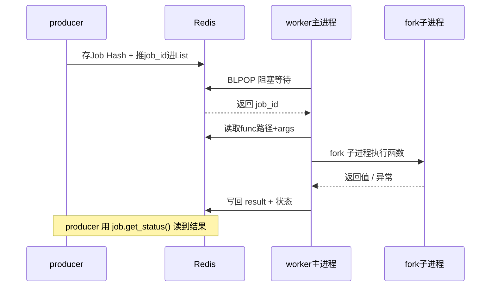
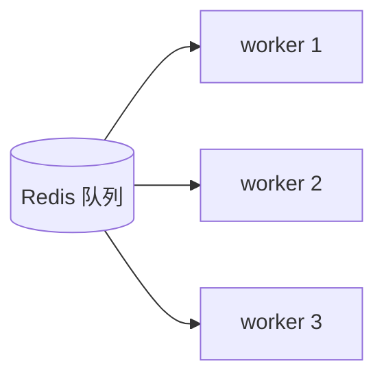

# RQ（Redis Queue）基础模块与接口速查

> 本文档基于本目录的示例（`producer.py` / `consumer.py` / `jobs.py` / `settings.py`）整理，
> 帮助快速理解 RQ 的核心概念和常用接口。

## 1. RQ 是什么

RQ（Redis Queue）是一个基于 **Redis** 的轻量级 Python 任务队列库，用来把「耗时任务」从主流程中剥离，丢到后台异步执行。

核心模型是**生产者 / 消费者**：

```
producer（生产者）  --enqueue-->  Redis 队列  --取出-->  worker（消费者）执行
```

- **生产者**：把任务塞进队列，立即返回，不等待结果。
- **消费者（worker）**：独立进程，从队列取任务并执行，结果写回 Redis。
- 两者不直接通信，全靠 Redis 中转。

## 2. 四个核心模块/对象

| 模块 / 对象 | 来源 | 作用 | 本例对应 |
|---|---|---|---|
| `redis.Redis` | `redis` 库 | 到 Redis 的连接 | `redis.Redis.from_url(REDIS_URL)` |
| `Queue` | `rq` | 队列，负责投递任务 | `producer.py` |
| `Worker` | `rq` | 工人，负责取任务执行 | `consumer.py` |
| `Job` | `rq` | 一次任务的句柄，查状态/结果 | `enqueue()` 的返回值 |

## 3. 连接 Redis

```python
import redis
conn = redis.Redis.from_url("redis://localhost:6379/0")
```

- `from_url(...)` 用 URL 形式连接，格式 `redis://host:port/db`。
- 生产者和消费者必须连**同一个 Redis、同一个 db**，否则看不到彼此的任务。

## 4. Queue —— 投递任务（生产者）

```python
from rq import Queue
queue = Queue("demo_queue", connection=conn)
```

### 常用接口

| 接口 | 说明 |
|---|---|
| `queue.enqueue(func, *args, **kwargs)` | 投递任务，返回 `Job` 对象，**立即返回不阻塞** |
| `len(queue)` | 当前排队（未执行）的任务数 |
| `queue.enqueue(func, arg, job_timeout=10)` | 投递时设置单任务超时（秒） |
| `queue.empty()` | 清空队列 |

### 投递示例（来自 `producer.py`）

```python
job1 = queue.enqueue(slow_add, 3, 4)               # 位置参数
job2 = queue.enqueue(greet, name="小明")            # 关键字参数
job3 = queue.enqueue(boom)                         # 无参数
job4 = queue.enqueue(slow_add, 100, 200, job_timeout=10)  # 自定义超时
```

> ⚠️ **重要**：被投递的函数（如 `slow_add`）必须定义在一个**可被 import 的模块**里（本例的 `jobs.py`），不能是 `__main__` 里的局部函数。因为 worker 是独立进程，靠「函数的导入路径」找到并执行任务。

## 5. Job —— 任务句柄

`enqueue()` 返回的 `Job` 对象代表「这一次任务」，用来查询进度和结果。

| 属性 / 方法 | 说明 |
|---|---|
| `job.id` | 任务唯一 id（UUID） |
| `job.get_status(refresh=True)` | 获取状态，`refresh=True` 强制从 Redis 刷新 |
| `job.result` | 任务返回值（未完成时为 `None`） |
| `job.is_finished` | 是否成功完成 |
| `job.is_failed` | 是否失败 |
| `job.exc_info` | 失败时的异常堆栈信息 |
| `job.enqueued_at` / `job.started_at` / `job.ended_at` | 各阶段时间戳 |

### 任务状态机

```
queued（排队）  ->  started（执行中）  ->  finished（成功）
                                      \-> failed（失败）
```

轮询示例（来自 `producer.py`）：

```python
status = job.get_status(refresh=True)   # queued / started / finished / failed
if status in ("finished", "failed"):
    ...
```

## 6. Worker —— 执行任务（消费者）

```python
from rq import Queue, Worker
queue = Queue("demo_queue", connection=conn)
worker = Worker([queue], connection=conn)
worker.work(with_scheduler=False)   # 阻塞循环：不断取任务执行，直到进程结束
```

| 接口 | 说明 |
|---|---|
| `Worker([queue], connection=conn)` | 创建工人，可同时监听多个队列 |
| `worker.work()` | 启动工作循环（**阻塞**），持续取任务执行 |
| `worker.work(with_scheduler=False)` | 不启用定时任务调度器 |

### 两种启动 worker 的方式

1. **代码方式**（本例 `consumer.py`）：显式 `Worker(...).work()`，可控性强。
2. **命令行方式**：`rq worker demo_queue`，RQ 自带的 CLI，更省事。

## 7. 完整流程（本例）

```mermaid
flowchart LR
    P["producer.py<br/>queue.enqueue()"] -->|写入任务| R[(Redis<br/>demo_queue)]
    R -->|取出任务| C["consumer.py<br/>Worker.work()"]
    C -->|执行 jobs.py 里的函数<br/>写回结果| R
    R -->|job.get_status()<br/>job.result| P
```

运行步骤（项目根目录下，Redis 已启动）：

```bash
# 终端 1：消费者（先启动，保持运行）
python tests/module/rq_demo/consumer.py

# 终端 2：生产者（投递任务）
python tests/module/rq_demo/producer.py
```

## 8. Worker 取任务与执行的原理

核心：**Redis 既是「排队传送带」（List），又是「任务数据存储」（Hash）**。worker 做的是一个循环：阻塞取号 → 按路径 import 函数 → fork 子进程执行 → 结果写回 Redis。

### 投递时 Redis 里存了什么

`queue.enqueue(slow_add, 3, 4)` 会写入两处：

- **Job 数据**（Hash，`rq:job:<id>`）：存**函数的导入路径**（`...jobs.slow_add`）、序列化的 `args/kwargs`、状态等。
  注意：存的不是函数代码，而是「到哪能 import 到它」——所以任务函数必须可被 import。
- **队列**（List，`rq:queue:demo_queue`）：把 `job_id` 推进去排队。

### worker 的执行循环

1. **阻塞取任务**：底层用 Redis `BLPOP` 盯着队列 List，空队列时挂起睡眠不占 CPU，有任务立刻唤醒返回 `job_id`。这就是 `worker.work()` 会一直阻塞的原因。
2. **读取并反序列化**：按 `job_id` 读 `rq:job:<id>` Hash，还原出函数路径和参数。
3. **动态 import 函数**：按路径 import 模块取到函数对象（所以 worker 必须能在 `sys.path` 找到 `jobs.py`，需从项目根目录运行）。
4. **fork 子进程执行**：默认 fork 一个子进程真正调用函数，做隔离——任务崩溃/超时不影响主 worker。
5. **结果写回 Redis**：成功存 `result` 状态置 `finished`；异常则状态 `failed`、堆栈存 `exc_info`。
6. 回到第 1 步等下一个任务。



## 9. 常见易错点

| 问题 | 原因 | 解决 |
|---|---|---|
| 任务一直 `queued` 不执行 | 没启动 worker / worker 连了别的队列 | 启动 `consumer.py`，确认队列名一致 |
| worker 报 `ModuleNotFoundError` | 找不到任务函数的导入路径 | 任务函数放在可 import 的模块，从项目根目录运行 |
| `fakeredis` 下异步不工作 | 假 Redis 数据不跨进程共享 | 异步必须用真 Redis；fakeredis 只能同步 |
| 任务超时被杀 | 默认超时 180 秒 | `enqueue(..., job_timeout=N)` 调大 |

## 10. 并发与扩容：worker 有线程池吗？

**没有。** 默认 `Worker` 是**单进程、串行**执行，一次只处理一个任务，**不会按负载自动扩容**线程或进程。

- 每个任务虽然会 fork 一个子进程，但主进程会**阻塞等它跑完**才取下一个 —— fork 是为了隔离/超时控制，**不是并发**。
- 大量任务涌入时，任务**不会丢**，全部在 Redis 队列里排队，worker 一个个慢慢处理，吞吐量不会自动提升。

### 想要并发 → 手动起多个 worker 进程（水平扩展）

```bash
python tests/module/rq_demo/consumer.py   # worker 1
python tests/module/rq_demo/consumer.py   # worker 2
python tests/module/rq_demo/consumer.py   # worker 3
```

多个 worker 一起从同一队列抢任务，靠 Redis `BLPOP` 保证「同一任务只被一个 worker 取到」，不会重复执行。



### 小结

| 问题 | 答案 |
|---|---|
| 有线程池吗？ | 没有，默认单进程串行 |
| 会按负载自动开更多线程/进程吗？ | 不会，任务只排队等 |
| 怎么提升并发？ | 手动启动多个 worker 进程 |
| 任务会丢吗？ | 不会，安全堆在 Redis 排队 |
| 自动伸缩怎么做？ | 靠外部编排（K8s HPA / 脚本监控 `len(queue)`）增减 worker |

> 补充：单进程内并发可选 `WorkerPool`（一条命令起多 worker）或配合 `gevent`（I/O 密集），但**都不是按负载自动伸缩**。

## 11. 一句话总结

- **`Queue.enqueue()`** = 派活（非阻塞）
- **`Worker.work()`** = 干活（阻塞循环）
- **`Job`** = 活的凭证，用来查状态和拿结果
- **Redis** = 中间的传送带，连接生产者和消费者
